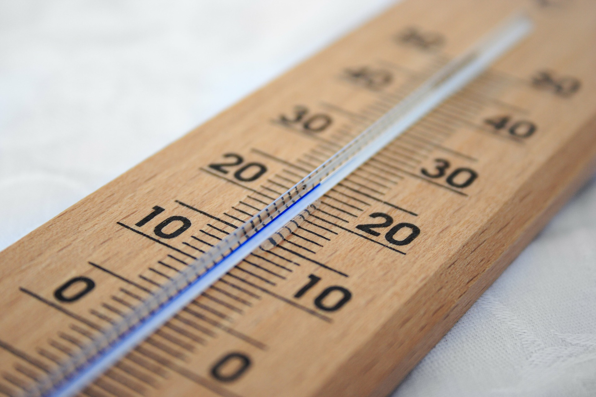

### 温度的变化
---

1.生活中的悖论：我们不喜欢变温，恰恰是四季温度的变化，给与了我们健康与智慧；我们不喜欢不确定性，恰恰是生活的不确定赋予个体生命的智慧和活着的意义。生活的智慧就在于掌握其中的确定与不确定，健康就在于在变温中保持恒温。

2.太冷和太热都不利于企业家精神。这就是为什么欧洲和东亚兴起。过冷人们会捂热被窝，过长的冬季会令人懒散，过热没有四季的变化，缺乏跨越均衡的勇气锻炼，以及忍受困苦的毅力。人的文化说到底还是环境的产物。环境设定了人类行为的底线。

**写于2019.1.3**